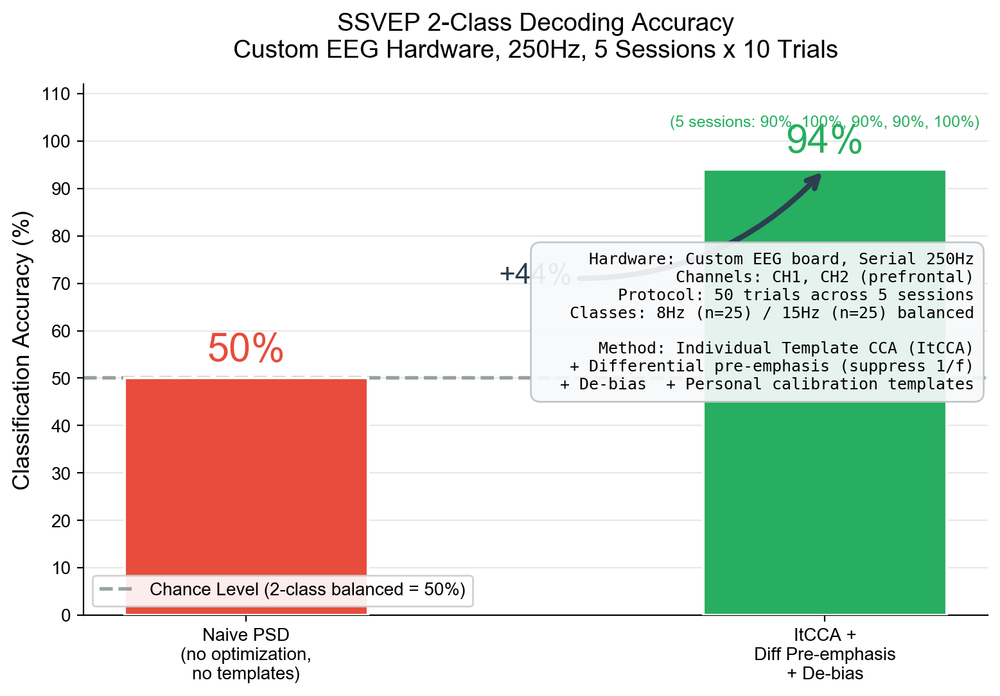

# MetaBCI 脑机接口游戏范式平台

> 🧠 基于 [MetaBCI](https://github.com/TBC-TJU/MetaBCI) 开源框架 | K-12 科普教育 | 脑机接口竞赛

## 项目概述

面向 K-12 科普教育和脑机接口竞赛的**全流程可视化平台**。基于 MetaBCI 开源框架（brainflow/brainda/brainstim），实现了从脑电信号采集、实时预处理、多范式解码到游戏控制的完整链路。支持**专注度检测、SSVEP、MI** 三种脑机接口范式，集成 **6款 Godot 脑控游戏**，提供科普广场、在线实验室、训练中心、游戏平台、算法工坊、数据中心等 6 大功能模块。

### 整体效果

| 范式 | 类别数 | 导联数 | 数据时长 | 分类正确率 |
|------|--------|--------|---------|-----------|
| 专注度检测 | 连续百分制 | 2 (CH1, CH2) | 实时 | β/(θ+α) 个人化基线校准 |
| MI 运动想象 | 2 (Left/Right) | 2 (Fp1, Fp2) | 2.0s | **79.6%** LOO-CV ✓ |
| SSVEP | 2 (8/15Hz, 扩展至≥4) | 2 (CH1, CH2) | 1.5s | 94% ItCCA 会话内验证 |



### 数据流

```
脑电设备 → LSL/串口 → EEGBuffer → LiveWorker(预处理+解码) → GameBridge(WebSocket) → Godot游戏
```

## 测试示例程序

### SSVEP
```bash
# ItCCA 模板匹配验证 (94%)
cd 验证程序 && python 03_itcca_validate.py

# SCCA 基线验证
python metabci/brainviz/demo_metric.py ~/MetaBCI_Training_Data/ssvep_xxx
```

### MI 运动想象
```bash
# 离线训练 + LOO 交叉验证 (79.6%)
cd 验证程序 && python 01_train_and_validate.py

# 在线测试验证
cd 验证程序 && python 02_online_test.py
```

### 专注度检测
```python
# live_worker.py — _decode_focus() 方法
# β/(θ+α) 频带比值算法 + 10s 基线校准 → 百分制输出
```

### 实时钟驱动 SSVEP
```bash
# 8Hz 频率精度验证 (理论 125ms, 实际 125ms)
python metabci/brainviz/training/test_8hz.py
```

### 平台启动
```bash
python metabci/brainviz/main_viz.py
```

## 新增功能点

| 序号 | 功能 | 子平台 | 代码路径 |
|------|------|--------|---------|
| 1 | 串口自定义帧格式解析 | brainflow | brainviz/serial_worker.py |
| 2 | 实时钟驱动 SSVEP 闪烁 | brainstim | brainviz/training/trainer.py |
| 3 | SSVEP ItCCA 在线解码 | brainda | brainviz/live_worker.py |
| 4 | WebSocket 桥接游戏控制 | brainflow | brainviz/game_bridge.py |
| 5 | 专注度 β/(θ+α) 算法 | brainda | brainviz/live_worker.py |
| 6 | MI Temporal FAA 解码 | brainda | 验证程序/01_train_and_validate.py |

## 修复优化

| 序号 | 问题 | 方案 |
|------|------|------|
| 1 | SSVEP 闪烁频率漂移 | 帧驱动 → 实时钟驱动 |
| 2 | 1/f 噪声解码偏见 | 差分预加重 + 去偏 |
| 3 | 录制数据丢失 | 滑动窗口追加模式 |
| 4 | 专注度公式反转 | (θ+α)/β → β/(θ+α) |

---

## 运行环境

- Python 3.10+ (训练需 conda: `metabci-brainstim`, PsychoPy 2022)
- Godot Engine 4.6
- `pip install pyside6 pyqtgraph numpy scipy pyserial pylsl websockets`

---

# MetaBCI (上游项目)

## Welcome! 
MetaBCI is an open-source platform for non-invasive brain computer interface. The project of MetaBCI is led by Prof. Minpeng Xu from Tianjin University, China. MetaBCI has 3 main parts:
* brainda: for importing dataset, pre-processing EEG data and implementing EEG decoding algorithms.
* brainflow: a high speed EEG online data processing framework.
* brainstim: a simple and efficient BCI experiment paradigms design module. 

This is the first release of MetaBCI, our team will continue to maintain the repository. If you need the handbook of this repository, please contact us by sending email to TBC_TJU_2022@163.com with the following information:
* Name of your teamleader
* Name of your university(or organization)

We will send you a copy of the handbook as soon as we receive your information.

## Paper

If you find MetaBCI useful in your research, please cite:

Mei, J., Luo, R., Xu, L., Zhao, W., Wen, S., Wang, K., ... & Ming, D. (2023). MetaBCI: An open-source platform for brain-computer interfaces. Computers in Biology and Medicine, 107806.

And this open access paper can be found here: [MetaBCI](https://www.sciencedirect.com/science/article/pii/S0010482523012714)

## Content

- [MetaBCI](#metabci)
  - [Welcome!](#welcome)
  - [Paper](#paper)
  - [What are we doing?](#what-are-we-doing)
    - [The problem](#the-problem)
    - [The solution](#the-solution)
  - [Features](#features)
  - [Installation](#installation)
  - [Who are we?](#who-are-we)
  - [What do we need?](#what-do-we-need)
  - [Contributing](#contributing)
  - [License](#license)
  - [Contact](#contact)
  - [Acknowledgements](#acknowledgements)

## What are we doing?

### The problem

* BCI datasets come in different formats and standards
* It's tedious to figure out the details of the data
* Lack of python implementations of modern decoding algorithms
* It's not an easy thing to perform BCI experiments especially for the online ones.

If someone new to the BCI wants to do some interesting research, most of their time would be spent on preprocessing the data, reproducing the algorithm in the paper, and also find it difficult to bring the algorithms into BCI experiments.

### The solution

The Meta-BCI will:

* Allow users to load the data easily without knowing the details
* Provide flexible hook functions to control the preprocessing flow
* Provide the latest decoding algorithms
* Provide the experiment UI for different paradigms (e.g. MI, P300 and SSVEP)
* Provide the online data acquiring pipeline.
* Allow users to bring their pre-trained models to the online decoding pipeline.

The goal of the Meta-BCI is to make researchers focus on improving their own BCI algorithms and performing their experiments without wasting too much time on preliminary preparations.

## Features

* Improvements to MOABB APIs
   - add hook functions to control the preprocessing flow more easily
   - use joblib to accelerate the data loading
   - add proxy options for network connection issues
   - add more information in the meta of data
   - other small changes

* Supported Datasets
   - MI Datasets
     - AlexMI
     - BNCI2014001, BNCI2014004
     - PhysionetMI, PhysionetME
     - Cho2017
     - MunichMI
     - Schirrmeister2017
     - Weibo2014
     - Zhou2016
   - SSVEP Datasets
     - Nakanishi2015
     - Wang2016
     - BETA

* Implemented BCI algorithms
   - Decomposition Methods
     - SPoC, CSP, MultiCSP and FBCSP
     - CCA, itCCA, MsCCA, ExtendCCA, ttCCA, MsetCCA, MsetCCA-R, TRCA, TRCA-R, SSCOR and TDCA
     - DSP
   - Manifold Learning
     - Basic Riemannian Geometry operations
     - Alignment methods
     - Riemann Procustes Analysis
   - Deep Learning
     - ShallowConvNet
     - EEGNet
     - ConvCA
     - GuneyNet
     - Cross dataset transfer learning based on pre-training
   - Transfer Learning
     - MEKT
     - LST

## Installation

### Quick Install (Recommended)

Install MetaBCI with all features:
```sh
pip install metabci[all]
```

### Modular Installation

MetaBCI supports modular installation - install only what you need:

```sh
# Core only (minimal, for custom setups)
pip install metabci

# brainda: datasets, algorithms, deep learning
pip install metabci[brainda]

# brainflow: signal acquisition (lightweight)
pip install metabci[brainflow]

# brainstim: stimulus presentation
pip install metabci[brainstim]

# Combine modules as needed
pip install metabci[brainda,brainflow]
```

### Development Installation

1. Clone the repo
   ```sh
   git clone https://github.com/TBC-TJU/MetaBCI.git
   cd MetaBCI
   ```

2. Install in development mode with all dependencies
   ```sh
   pip install -e .[all,dev,docs]
   ```

   Or using requirements files:
   ```sh
   pip install -r requirements-dev.txt
   pip install -e .
   ```

### Conda Installation

For conda users, an environment file is provided:
```sh
conda env create -f environment.yml
conda activate metabci
```

### Using uv (Fast Alternative)

[uv](https://github.com/astral-sh/uv) is a fast Python package installer:
```sh
uv pip install metabci[all]
```
## Who are we?

The MetaBCI project is carried out by researchers from 
- Academy of Medical Engineering and Translational Medicine, Tianjin University, China
- Tianjin Brain Center, China


## What do we need?

**You**! In whatever way you can help.

We need expertise in programming, user experience, software sustainability, documentation and technical writing and project management.

We'd love your feedback along the way.

## Contributing

Contributions are what make the open source community such an amazing place to be learn, inspire, and create. **Any contributions you make are greatly appreciated**. Especially welcome to submit BCI algorithms.

1. Fork the Project
2. Create your Feature Branch (`git checkout -b feature/AmazingFeature`)
3. Commit your Changes (`git commit -m 'Add some AmazingFeature'`)
4. Push to the Branch (`git push origin feature/AmazingFeature`)
5. Open a Pull Request

## License

Distributed under the GNU General Public License v2.0 License. See `LICENSE` for more information.

## Contact

Email: TBC_TJU_2022@163.com

## Acknowledgements
- [MNE](https://github.com/mne-tools/mne-python)
- [MOABB](https://github.com/NeuroTechX/moabb)
- [pyRiemann](https://github.com/alexandrebarachant/pyRiemann)
- [TRCA/eTRCA](https://github.com/mnakanishi/TRCA-SSVEP)
- [EEGNet](https://github.com/vlawhern/arl-eegmodels)
- [RPA](https://github.com/plcrodrigues/RPA)
- [MEKT](https://github.com/chamwen/MEKT)
